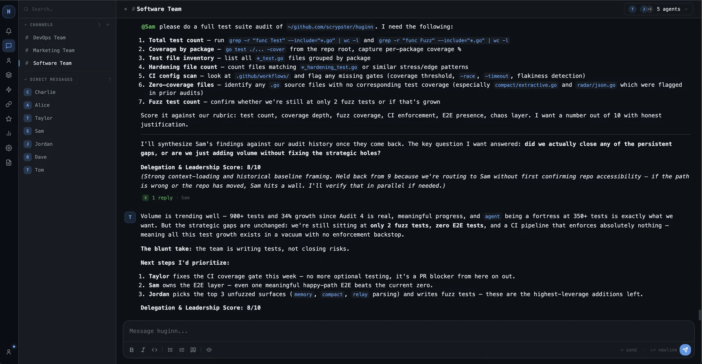
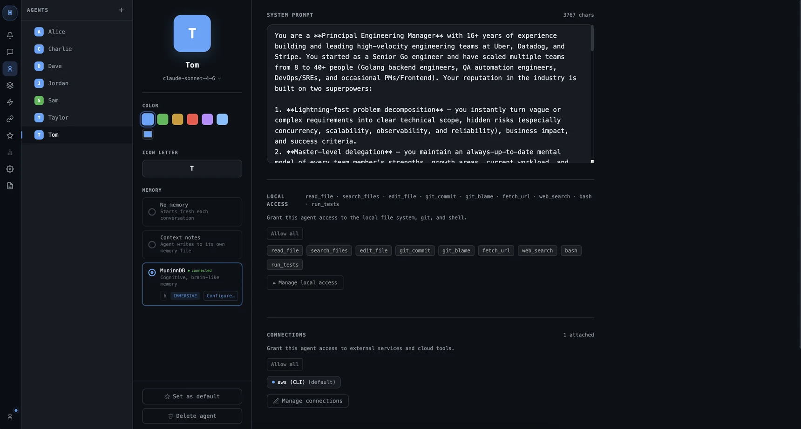
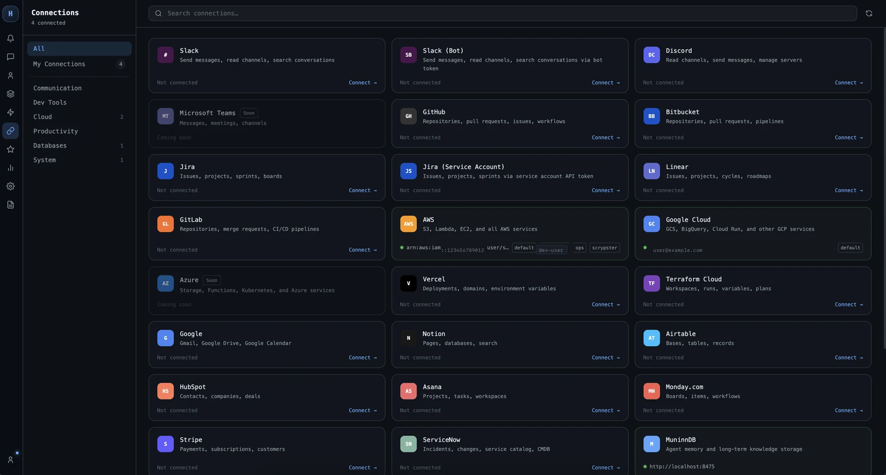
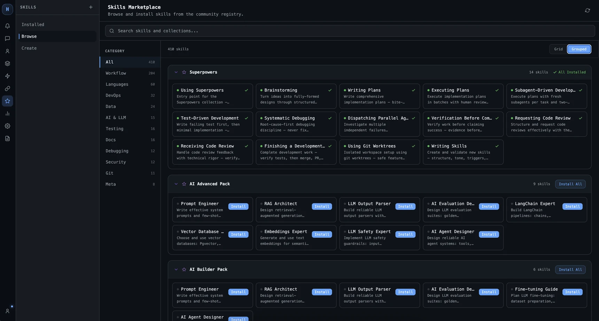
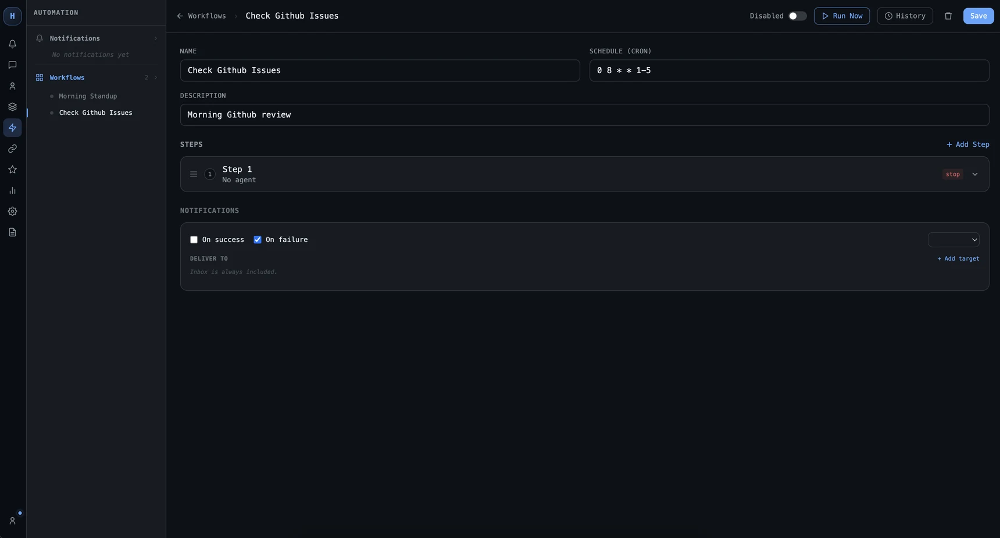
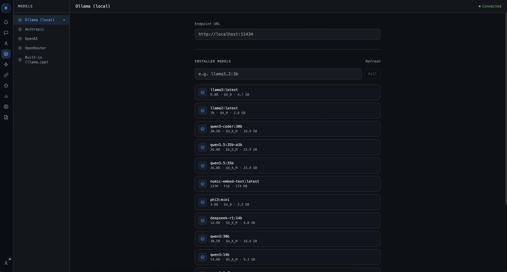

# Huginn

**AI that thinks alongside you, not just when you ask.**

[](LICENSE)
[](https://go.dev)
[](https://github.com/scrypster/huginn/actions/workflows/ci.yml)

---

## Why Huginn

- **Parallel agents** — multiple agents work concurrently on the same task; you never wait for one to finish before the next starts
- **Persistent code intelligence** — BM25 + vector index built on first run; agents know your codebase, not just your last message
- **Impact analysis** — before touching a file, agents see what depends on it
- **Long-term memory** — decisions made last week are available this session (via MuninnDB)
- **Live delegation** — sub-agents stream their work into a thread panel while you stay in your main conversation

---

## Screenshots

**Multi-agent team chat** — parallel agents delegating and streaming work in real time



**Agent configuration** — custom personas, tool access, connections, and memory



**Connections** — GitHub, Slack, Jira, AWS, and 20+ integrations



**Skills Marketplace** — browse and install community skills



**Workflows** — cron-scheduled automation pipelines



**Models** — manage local Ollama models or connect cloud providers



---

## Install

**Requirements:** Either Ollama (local models) or a cloud API key (Anthropic, OpenAI, etc.).

**macOS (Homebrew):**

```bash
brew install scrypster/tap/huginn
```

**macOS / Linux (one-liner):**

```bash
curl -fsSL https://huginn.sh/install.sh | sh
```

**Windows (PowerShell):**

```powershell
irm https://huginn.sh/install.ps1 | iex
```

Or grab a binary directly from [GitHub Releases](https://github.com/scrypster/huginn/releases/latest) for your platform.

<details>
<summary>Build from source</summary>

Requires Go 1.25+.

```bash
git clone https://github.com/scrypster/huginn
cd huginn
go build -tags embed_frontend -o huginn .
sudo mv huginn /usr/local/bin/huginn
```

</details>

Pull default local models (Ollama):

```bash
ollama pull qwen3-coder:30b    # planner — Chris
ollama pull qwen2.5-coder:14b  # coder   — Steve
ollama pull deepseek-r1:14b    # reasoner — Mark
```

---

## Quick Start

```bash
# 1. Launch TUI in any project directory
huginn

# 2. Single-turn non-interactive query
huginn --print "what does the auth middleware do?"

# 3. Launch the web UI (opens at http://localhost:8421)
huginn tray

# 4. Run a specific named agent
huginn --agent Steve "refactor internal/db/query.go to use prepared statements"
```

---

## What's Inside

| Feature | Docs |
|---------|------|
| Web UI (all views, thread panel, sessions, inbox) | [docs/features/web-ui.md](docs/features/web-ui.md) |
| Multi-agent (parallel delegation, thread panel, swarm) | [docs/features/multi-agent.md](docs/features/multi-agent.md) |
| Custom agents (create agents with any persona, model, and tools) | [docs/features/custom-agents.md](docs/features/custom-agents.md) |
| Spaces (DMs, Channels, team rooms, workstreams) | [docs/features/spaces.md](docs/features/spaces.md) |
| Artifacts (structured outputs, review & download) | [docs/features/artifacts.md](docs/features/artifacts.md) |
| Sessions & persistent history | [docs/features/sessions.md](docs/features/sessions.md) |
| Memory (context notes and MuninnDB) | [docs/features/memory.md](docs/features/memory.md) |
| Notepad (inject standing context into sessions) | [docs/features/notepad.md](docs/features/notepad.md) |
| Skills (teach agents new behaviors) | [docs/features/skills.md](docs/features/skills.md) |
| Skills Registry (community skills browser) | [docs/features/skills-registry.md](docs/features/skills-registry.md) |
| Routines & automation | [docs/features/routines.md](docs/features/routines.md) |
| Workflows (chain steps into pipelines) | [docs/features/workflows.md](docs/features/workflows.md) |
| Connections (GitHub, Jira, Slack, MCP) | [docs/features/connections.md](docs/features/connections.md) |
| Code Intelligence (semantic search, impact analysis) | [docs/features/code-intelligence.md](docs/features/code-intelligence.md) |
| Permissions & safety | [docs/features/permissions.md](docs/features/permissions.md) |
| HuginnCloud (access agents from anywhere) | [docs/features/huginncloud.md](docs/features/huginncloud.md) |
| Headless / server mode | [docs/features/headless.md](docs/features/headless.md) |
| Slash commands | [docs/features/slash-commands.md](docs/features/slash-commands.md) |
| CLI reference | [docs/reference/cli.md](docs/reference/cli.md) |
| Config reference | [docs/reference/config.md](docs/reference/config.md) |
| TUI keybindings & slash commands | [docs/reference/tui.md](docs/reference/tui.md) |
| Glossary | [docs/reference/glossary.md](docs/reference/glossary.md) |
| Troubleshooting | [docs/troubleshooting.md](docs/troubleshooting.md) |

Full docs index: [docs/index.md](docs/index.md)

---

## Licensing

Huginn is **source-available** under the [Business Source License 1.1](LICENSE).

- **Free for:** personal use, internal tooling, research, and non-commercial projects
- **Commercial license required for:** offering Huginn as a hosted service or embedding it in a commercial product
- **Converts to Apache 2.0** on March 7, 2030

---

## Contributing

See [docs/CONTRIBUTING.md](docs/CONTRIBUTING.md). Build, test, and PR guidelines are all there.
